## About the use of the TradingView strategy
The trading View strategy enables automated trading in conjunction with trading view alerts. The following are the configuration steps required to use the Trading View strategy. Use Gmail to receive alerts.

### TradingView Alert Settings

Excuse me. Quick ly, sideways. There's a great article on ProjectBBB, so please set up alerts for your information.
https://note.mu/project_bbb/n/n8fa955df192d

Long alert messages include `Buy`, Short alert messages `Sell`, close alert messages with `Exit` characters
If you leave, you can set the rest as you like.

example:

```
alertcondition((sma_val < low_val), title="Long", message="Buy")
alertcondition((sma_val > high_val), title="Short", message="Sell")
alertcondition(RSI > RSI_top, title="Exit", message="Exit")
```

Oh, don't forget to gmail where the alerts are delivered.

### Gmail Settings

You need to enable the Gmail API from the following URL.

https://developers.google.com/gmail/api/quickstart/python?hl=ja

1. Please pop the button of "ENABLE THE GMAIL API" in the middle.

    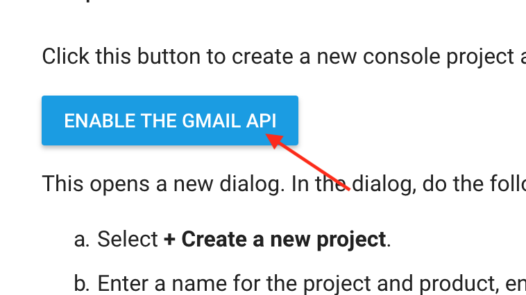

2. Select +Create a new project and press NEXT.

    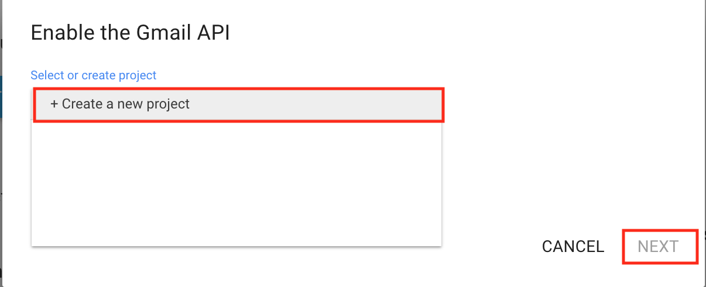

3. Type Ebisu in the project name and press NEXT.

    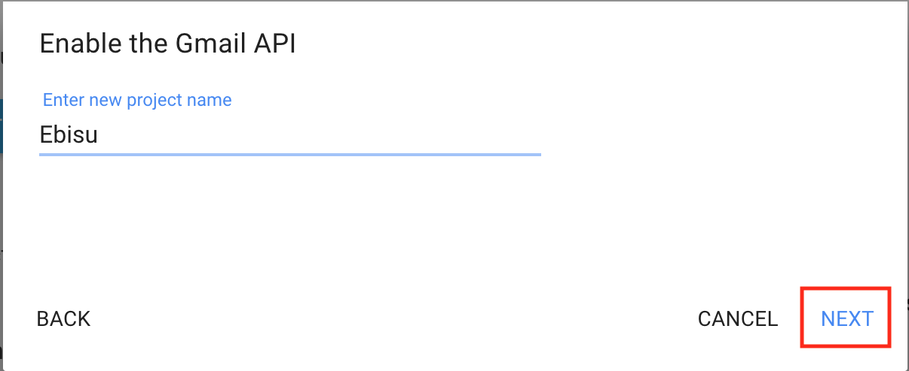

4. It's already time.

    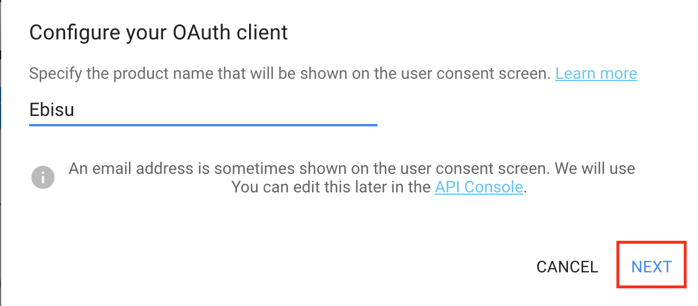

5. When it starts to turn round and round, wait for a while.

    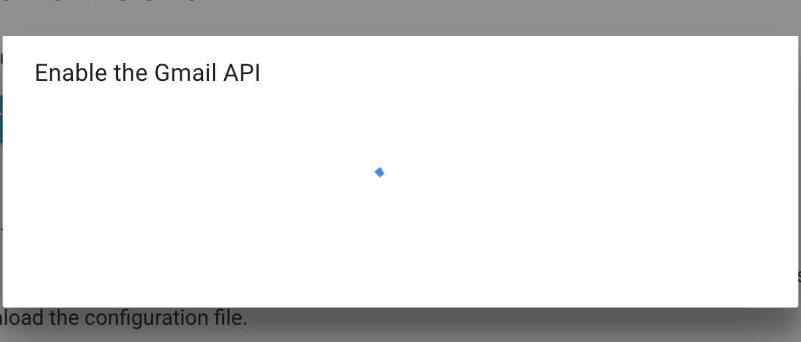

6. When you're done, press DOWNLOAD CLIENT CONFIGURATION.

    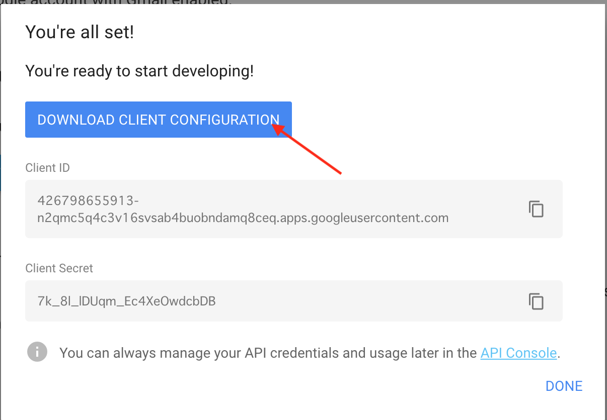

7. The configuration file is downloaded.

    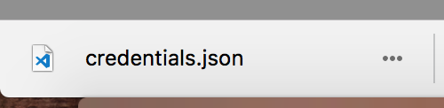

8. Place the downloaded file directly below the folder in the ebisu project.

    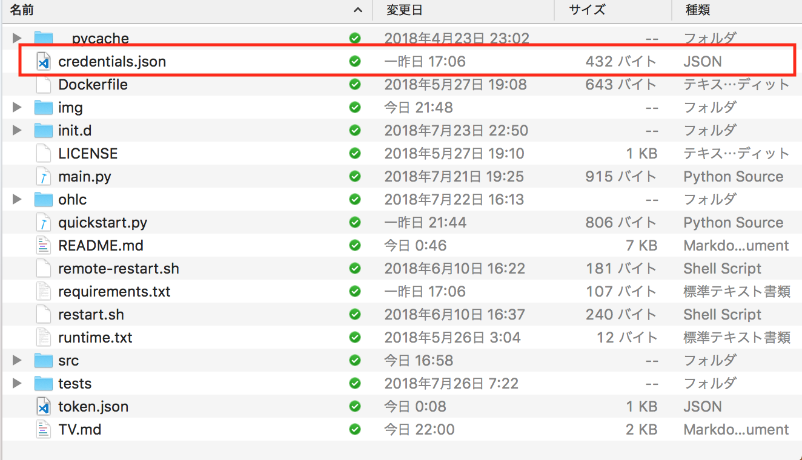

9. Run the program for token generation.

    ```bash
    $ pip install --upgrade google-api-python-client oauth2client
    $ python quickstart.py
    ```
    
10. Because the browser starts automatically, Google authentication is done.

    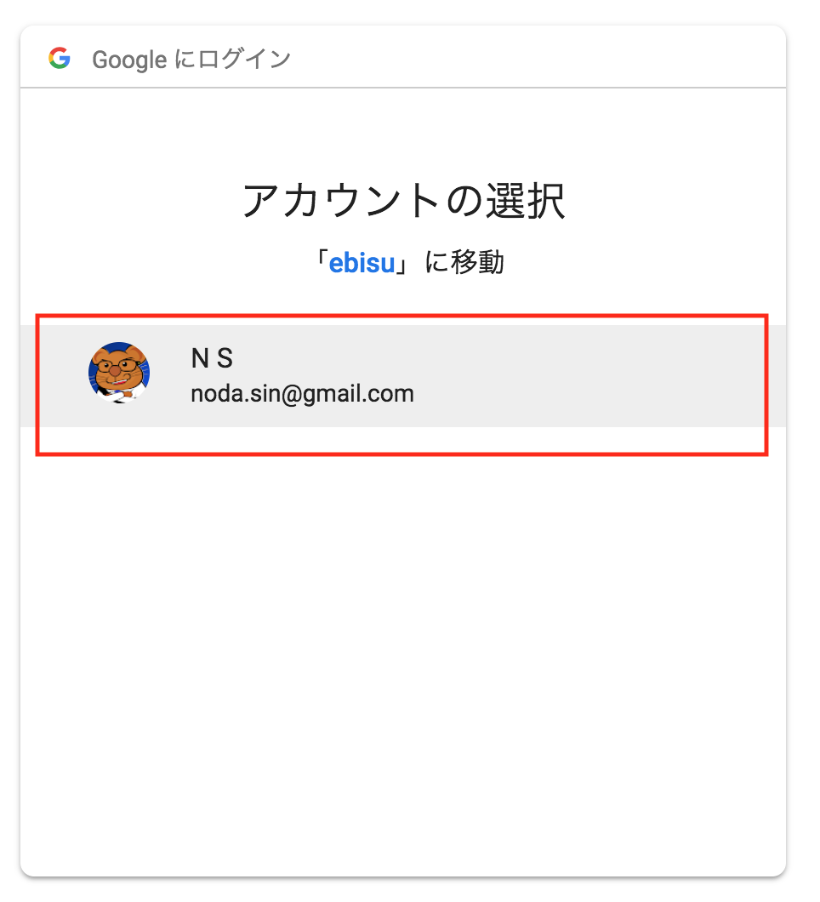

11. Press permission.

    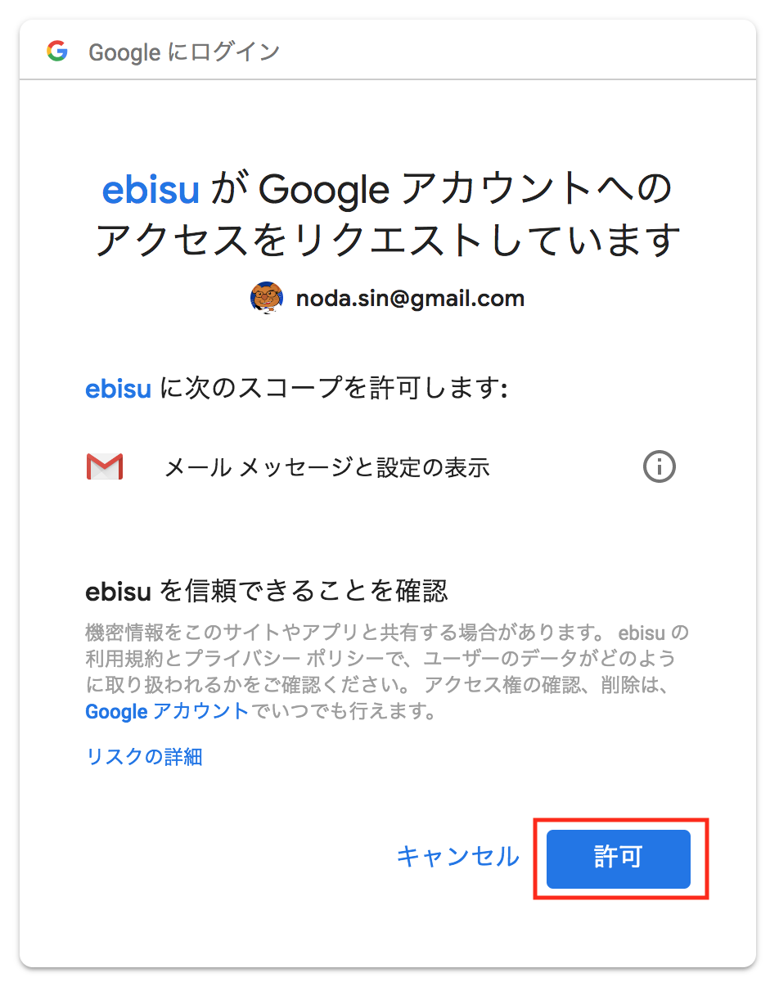

12. If successful, the browser displays "The authentication flow has completed".

    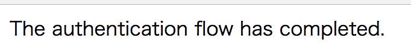

13. Make sure that a file named `token.json` is created directly below the folder in the ebisu project.

    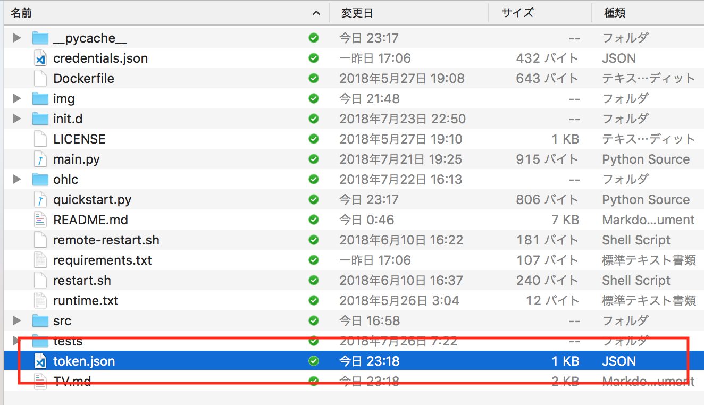

14. Set the Gmail address to the environment variable.

    ```
    $ vi ~/.bash_profile
    export GMAIL_ADDRESS=******@gmail.com
    ```

### Run

Run with `TV` in the `--strategy` option.

```bash
$ python main.py --strategy TV
```
